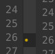

Validator
=========

[](https://travis-ci.org/maralla/validator.vim)

Syntax check framework for vim which checks syntax on the fly asynchronously.


Requirements
------------

You should have a relatively new version of vim which supports such features:
`job`, `timers` and `lambda`.

Your vim should be compiled with `python` or `python3`.

Validator relies on external syntax checkers, so you need to install the checkers
fit for the files you are editting.

Builtin Checkers
----------------

* c/c++, `clang-tidy`
* python, `flake8`
* cython, `cython`
* css, `csslint`
* javascript, `jshint`, `eslint`
* json, `jsonlint`
* sh, `sh`, `shellcheck`
* rst, `rst2pseudoxml`

Configuration
-------------

Select checkers for a file type:

```vim
let g:validator_{filetype}_checkers = ['<checker_name>']

" for example, choose eslint to check javascript:
let g:validator_javascript_checkers = ['eslint']
```

To customize error message:

```vim
let g:validator_error_msg_format = "[ ● %d/%d issues ]"
```

To auto open quickfix window:

```vim
let g:validator_auto_open_quickfix = 1
```

To handle file type alias:

```vim
let g:validator_filetype_map = {'<alias>': '<filetype_supported>'}

" for example
let g:validator_filetype_map = {"python.django": "python"}
```

Ignore file types:

```vim
let g:validator_ignore = ['<filetype>']
```

To customize the signs colors, you can use the following groups:

```vim
" For syntax errors & warnings
ValidatorErrorSign
ValidatorWarningSign

" For style errors & warnings
" (By default, use the same colors as the 2 groups above)
ValidatorStyleErrorSign
ValidatorStyleWarningSign
```

To show permanently the sign column and prevent annonying behavior when the
sign column appear and then it disappears.



```vim
let g:validator_permament_sign = 1
```

Install
-------

I recommend to use a plugin manager for installing.

If you use [vim-plug](https://github.com/junegunn/vim-plug)

    Plug 'maralla/validator.vim'

Usage
-----

Validator.vim automatically checks syntax in the background when file content
changes, so no need to do any trigger manually. If you do want to do a check
manually use this command `ValidatorCheck`. This command is especially useful
when you set the file type manually.
